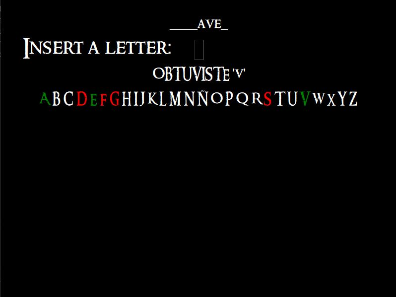

# LOTR Hangman (Tkinter)

A Lord of the Rings themed Hangman game built with Python and Tkinter.

The project is a GUI-based version of the classic Hangman game where the player guesses words related to the LOTR universe.

## Technologies
- Python
- Tkinter
- Pillow

## Status
Prototype / work in progress.  
The core gameplay is implemented, but the project still has planned improvements and bug fixes.

